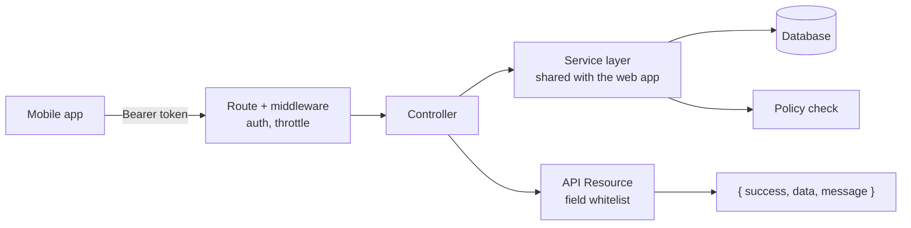

# AnglerHub API

## About the Project

AnglerHub API is the Laravel REST layer behind
[AnglerHub Mobile](https://github.com/Voorbeelden/AnglerMobile): the
endpoints a phone standing at the edge of a lake actually talks to, kept
in its own repository, separate from
[AnglerHub Web](https://github.com/Voorbeelden/AnglerWeb), which shows
the traditional, session-based Blade side of the same application.

In the real application, the API isn't a separate system bolted onto the
website — it's the same models, the same services, the same Policies,
just reached through a different door. A club officer approving a payment
from the web dashboard and a club officer approving the same payment from
their phone hit the same authorization rule either way. This repository
is a **curated excerpt**, not the full API — see
[Repository scope](#repository-scope) for exactly what's shown and what
isn't.

## What's here

- **Authentication** — Sanctum token issuance, a 2FA challenge-token flow,
  and a server-enforced block on staff accounts ever authenticating
  through the mobile client.
- **Weigh-ins** — the endpoint the mobile app's offline sync queue talks
  to, including batch/idempotent sync after a period offline.
- **Standings** — yearly rankings, filterable by year/type/date range.
- **A uniform response envelope** (`{ success, data, message }`), shared
  across every endpoint via a trait.
- **API Resources used as a security boundary** — explicit field
  whitelisting rather than serializing Eloquent models directly.

## Technologies

- PHP / Laravel
- Laravel Sanctum (token authentication, no cookies/sessions involved)
- MySQL, Eloquent ORM (models themselves are not part of this excerpt)
- API Resources for response shaping
- Rate limiting configured per endpoint group, not a single blanket rule

## Development Approach

The API was added on top of an already-live web application once the
mobile app needed a way to reach the same data — it was never designed
from a blank slate independently of the website. That ordering shows in
one rule stated directly in `routes/api.php`: every endpoint reuses the
exact same service layer and Policy classes as the corresponding web
controller. The only thing that's genuinely different between a web
request and an API request is the response format — a Blade view versus
a `JsonResponse` built from an API Resource — never the business logic
itself.



A request never skips the Resource layer on its way out — even a field
that's harmless to expose still goes through the whitelist, so adding a
new field to a model is a deliberate choice about the API's shape, not an
accident of how `toArray()` happens to serialize it.

## Architecture

**The server owns idempotency for offline sync.** The mobile app generates
a UUID per weigh-in at the moment it's recorded locally, before it's ever
sent anywhere. `WeighInController::sync()` processes a batch of those one
at a time, so a single failing item never blocks the rest of the batch —
and a retried request after a dropped connection is a no-op the second
time, not a duplicate.

**Rate limiting matched to how each endpoint is actually used**, not one
blanket limit — login gets a stricter limit than general traffic; the
weigh-in endpoints get a *higher* limit, since several people legitimately
record weights in quick succession on a competition day.

**Field whitelisting is enforced structurally.** `ClubResource` explicitly
documents which fields must never appear in a response (payment-provider
IDs, bank account numbers, invite codes) — an earlier version of
`AuthController::me()` did leak a raw model relation, and fixing it is
what led to writing that whitelist down explicitly rather than trusting
it to stay obvious. See the resource's own doc comment, and
[Security and Privacy](#security-and-privacy) below.

## Working with Data

Every response goes through an API Resource, never a raw model cast.
`WeighInResource` in particular mirrors the mobile app's `WeighingModel`
DTO field-for-field — keeping the two in sync as the contract evolves is
a manual discipline, not something a compiler enforces, which is part of
why the field list stays deliberately small and stable rather than
growing ad hoc.

Standings and per-member competition history are computed by a dedicated
service (`StandingsService`, not included in this excerpt) and consumed
identically by the API's `StandingsController` and its web equivalent —
the calculation exists in exactly one place regardless of which client
asked for it.

## Security and Privacy

A few things worth naming specifically, since "this was sanitized" is a
weaker claim than showing the actual mechanism:

- **Field whitelisting is structural, not a convention people have to
  remember.** `ClubResource`'s own doc comment lists exactly which fields
  must never appear in a club API response — so a future field added to
  the underlying model can't silently leak into the API the way it could
  if a controller ever returned a model directly. This came from a real
  bug: an earlier `AuthController::me()` did return a raw relation, and
  fixing it is what led to writing the whitelist down explicitly.
- **Staff accounts are blocked from the mobile API on the server**, not
  just by omission in the app's UI — `AuthController::login()` checks the
  user's role *before* issuing a token, so a modified client talking to
  this API directly still can't obtain a valid staff token.
- **2FA uses a short-lived, single-use challenge token**, not a session
  variable (the API is stateless) — a password check alone never issues
  an access token if 2FA is enabled, and the challenge token is deleted
  the moment it's used, not just left to expire.
- **Route paths, class, method and field names in this excerpt are
  translated/renamed from the original, Dutch-language production code**
  (`/wedstrijden` → `/competitions`, `gewicht` → `weight`, and so on).
  This is a real, live product, and keeping this excerpt's naming
  distinct from the exact strings the production API uses avoids handing
  anyone inspecting network traffic on the live site a literal map of it.

## Repository layout

```
anglerhub-api/
├── routes/
│   └── api.php                                 routes for the 3 controllers below
├── app/Http/Controllers/Api/
│   ├── V1/
│   │   ├── AuthController.php                  Sanctum tokens, 2FA challenge flow, staff-login block
│   │   ├── WeighInController.php                weigh-in recording + offline batch sync
│   │   └── StandingsController.php              standings + per-member detail
│   └── Concerns/
│       └── ApiResponses.php                    the shared { success, data, message } envelope
└── app/Http/Resources/Api/V1/
    ├── ClubResource.php                        field whitelist + server-computed capabilities
    ├── WeighInResource.php                     mirrors the mobile app's WeighingModel DTO
    └── UserResource.php                        minimal field whitelist
```

## Repository scope

Why a separate repo from [AnglerHub Web](https://github.com/Voorbeelden/AnglerWeb)
in the first place: the API and the web application share the same
underlying models, services and Policies — only the response format
differs. Splitting them into two repos isn't about the code being
unrelated; it's about letting someone who specifically wants to see "how
do you design a REST API for a mobile client" find exactly that, without
wading through unrelated Blade/session code — and vice versa for someone
evaluating traditional Laravel MVC work.

Within that scope:

- **The actual business logic services are not included**
  (`ParticipantService`, `StandingsService`) — these are where
  competition rules, capping/disqualification logic, and standings
  calculations actually live, referenced from the controllers above but
  not shown. Same reasoning as the excluded scheduling-engine controllers
  in the [Calenderapp excerpt](https://github.com/Voorbeelden/.NetCoreApp):
  it's both the most substantial part of the system to build and the
  part I'd rather not hand over as a ready-made blueprint.
- **Eloquent models are not included.** They'd mostly reveal database
  schema and relationships without adding much beyond what the Resources
  above already show field-by-field.
- **Payments (Stripe Connect), admin/support tooling, and every other
  controller beyond the 3 shown are not included.**

**This excerpt won't run standalone** — it references services, models
and Policies that aren't part of this repository. It's meant to be read,
not deployed.

## Development Responsibilities

### API Design
Designing a v1 REST API on top of an existing web application's models
and services, specifically for the mobile client — including the
response envelope, the authentication strategy, and the rule that
business logic is never re-implemented per client.

### Backend Development
Laravel/Eloquent, Sanctum token auth, Policy-based authorization, and
rate limiting tuned per endpoint group rather than a single global rule.

### Security
Structural field whitelisting via API Resources, a server-side
authorization boundary a client-side app alone can't bypass, and a
stateless 2FA challenge-token flow.

### Cross-Platform Contract Design
Keeping the mobile app's expected response shape (see
`WeighInResource` vs. the mobile repo's `WeighingModel`) in sync as the
API evolves, and making sure a rule enforced on the web side produces the
identical result when reached through this API instead.

### Testing
Feature tests around the authentication flow (including the 2FA
challenge and the staff-login block) and the weigh-in sync endpoint's
idempotency behaviour specifically — the case most likely to silently
break without a test catching it.

## Business Functionality

The mobile app authenticates once and gets a long-lived Sanctum token;
from there, every request that touches a club's data returns not just
the data itself but a `capabilities` object computed server-side, which
the app uses to decide what to show — no permission logic is
re-implemented on the client. Weigh-ins recorded offline sync in batches,
each one idempotent by its client-generated UUID, so a flaky connection
at the waterside can never result in a duplicated or lost result.
Standings are computed once, server-side, and returned identically
whether the request came from this API or from the web dashboard.

## Future Improvements

- **`ClubResource` computes its own `capabilities` object inline**,
  calling into `AuthorizationService` for each of roughly seven
  permission checks. That's a lot of responsibility for a class whose
  main job is field shaping — I'd move capability computation into its
  own dedicated service that any future consumer could call, rather than
  growing the Resource further every time a new capability is needed.
- **No automated test currently asserts that a sensitive field can never
  appear in a response.** The `me()` endpoint's past raw-model leak (see
  [Security and Privacy](#security-and-privacy)) was caught by review,
  not by a test failing. A test that fails the moment an unlisted field
  (like a payment-provider ID) shows up in a serialized response would
  catch a regression immediately instead of relying on someone noticing.
- **`routes/api.php`, at full size, covers the entire v1 surface in one
  file.** This excerpt only shows the slice for 3 controllers, but
  splitting the real file into per-domain route files (competitions,
  payments, weigh-ins) included from one entry point would scale better
  than a single, ever-growing file.

## What this demonstrates

- Designing a REST API on top of an existing application without
  duplicating its business logic per client
- API Resources used deliberately as a security boundary, not just a
  formatting convenience
- Token auth (Sanctum) with 2FA and a server-enforced staff/member
  authorization boundary
- Idempotent, batchable endpoints designed specifically for an
  offline-first mobile client
- Recognizing and fixing a real data-exposure bug, and turning that into
  a structural safeguard rather than a one-off patch

## Development Summary

This API grew as a second door onto an already-live application rather
than a system designed in isolation — every endpoint here reuses the same
service layer and Policies the web dashboard already had, with only the
response shape (JSON via an explicit field whitelist, instead of a Blade
view) genuinely different. The result is a small, focused REST layer
built specifically around what an offline-first mobile client needs:
idempotent writes, a predictable response envelope, and authorization
that's computed once, server-side, and trusted by the client rather than
re-derived.

## License

Shared for portfolio purposes only. Not licensed for reuse, redistribution
or use as a starting point for a similar application.
